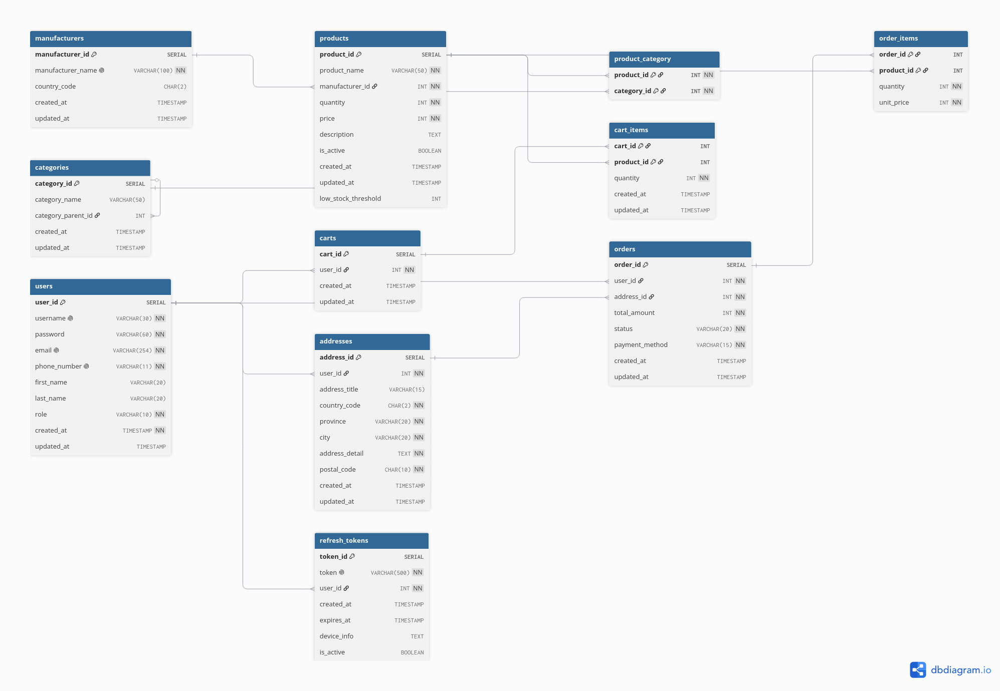

# Shopora

A production-inspired e-commerce backend built with Node.js, Express, and TypeScript.

## Overview

Shopora is an e-commerce platform inspired by well-known online marketplaces such as Digikala.

The project focuses on backend architecture, clean code practices, scalability, and real-world software engineering concepts rather than frontend development.

## Goals

The main goals of this project are:

- Learn enterprise backend architecture
- Build a scalable REST API
- Practice authentication and authorization
- Implement Role-Based Access Control (RBAC)
- Use Redis for caching and performance optimization
- Work with background jobs (Cron Jobs)
- Implement file uploads using Object Storage
- Document APIs with Swagger
- Containerize the application using Docker
- Deploy a production-ready backend

## Tech Stack

- Node.js
- Express.js
- TypeScript
- PostgreSQL
- Redis
- Passport.js
- JWT
- Swagger (OpenAPI)
- Docker
- Docker Compose
- MinIO (S3-Compatible Object Storage)

## Database Schema

The database was designed around 11 core tables, modeling one-to-one, one-to-many, and many-to-many relationships (with junction tables), a self-referencing hierarchy for nested categories, and price/quantity snapshotting for order history integrity.

Full SQL schema: [`database/schema.sql`](database/schema.sql)

**Tables:**

| Table | Purpose |
|---|---|
| `users` | User accounts, credentials, and roles |
| `products` | Product catalog |
| `manufacturers` | Brands/manufacturers (one-to-many with products) |
| `categories` | Nested product categories (self-referencing) |
| `product_category` | Many-to-many junction between products and categories |
| `carts` | One cart per user |
| `cart_items` | Products inside a cart |
| `addresses` | User shipping addresses (one-to-many) |
| `orders` | Placed orders |
| `order_items` | Snapshot of purchased products (price locked at purchase time) |
| `refresh_tokens` | JWT refresh tokens per device/session |

## Main Features

### Authentication
- User Registration
- User Login
- JWT Authentication
- Refresh Tokens
- Logout
- Password Hashing

### Authorization
- Role-Based Access Control (RBAC)
- Roles: User, Admin

### Products
- Browse Products
- Search Products
- Filter Products
- Sort Products
- Pagination
- Product Categories

### Shopping Cart
- Add Items
- Remove Items
- Update Item Quantity

### Orders
- Place Orders
- Order History
- Order Status
- Order Tracking

### Product Images
- Upload Product Images
- Store Images in S3-Compatible Object Storage
- Generate Public Image URLs

### Admin Panel
- Dashboard
- Manage Products
- Manage Categories
- Manage Orders
- Manage Users

### Redis
- Product Cache
- Cart Cache
- Rate Limiting
- JWT Token Blacklist

### Background Jobs (Cron Jobs)
- Detect Low Stock Products
- Clear Abandoned Carts
- Remove Expired Refresh Tokens
- Daily Maintenance Tasks

### File Upload
- Upload Files
- Store Files using S3-Compatible Object Storage
- Use MinIO for Local Development
- Generate Public URLs for Uploaded Files

### API Documentation
- Swagger (OpenAPI)

## Deployment

Docker Compose services:

- API
- PostgreSQL
- Redis
- MinIO (Object Storage)

## Object Storage

This project uses MinIO, an S3-compatible object storage service running inside Docker for local development.

The implementation demonstrates:

- Creating Buckets
- Uploading Files
- Downloading Files
- Deleting Files
- Generating Public URLs
- S3 SDK Integration

## Roadmap

- [ ] Design Database
- [ ] Authentication
- [ ] Authorization (RBAC)
- [ ] Products
- [ ] Categories
- [ ] Shopping Cart
- [ ] Orders
- [ ] Admin APIs
- [ ] Redis Integration
- [ ] Object Storage (S3 / MinIO)
- [ ] File Upload
- [ ] Background Jobs (Cron Jobs)
- [ ] Swagger Documentation
- [ ] Dockerization
- [ ] Production Deployment

## Future Improvements

- Payment Gateway Integration
- Wishlist
- Product Reviews & Ratings
- Email Notifications
- Order Email Confirmation
- Recommendation System
- Elasticsearch Product Search
- WebSocket Notifications
- CI/CD Pipeline
- Automated Testing (Jest)
- Monitoring & Logging

---

The primary purpose of this project is to simulate the architecture and workflows of a production-grade e-commerce backend while applying modern backend development best practices.
